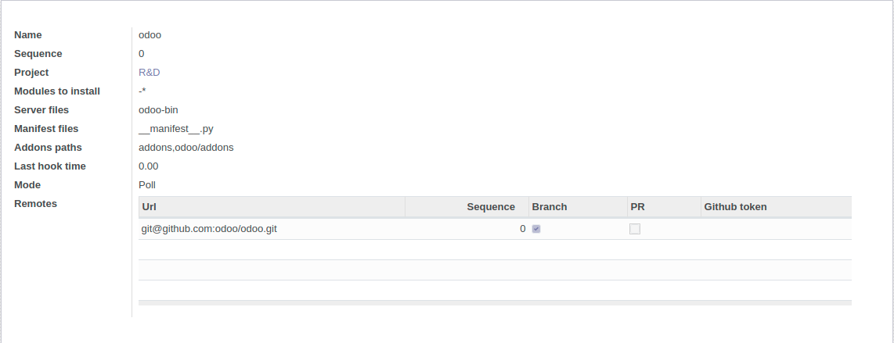
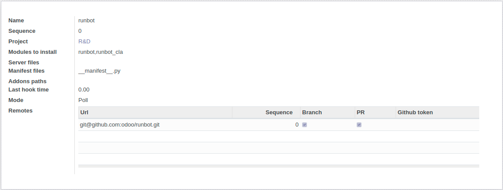
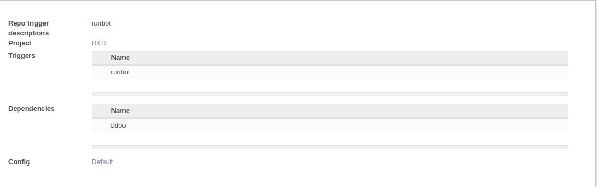

[](http://runbot.odoo.com/runbot)

# Odoo Runbot Repository

This repository contains the source code of Odoo testing bot [runbot.odoo.com](http://runbot.odoo.com/runbot) and related addons.

------------------

## Warnings

**Runbot will delete folders/ drop database to free some space during usage.** Even if only elements create by runbot are concerned, don't use runbot on a server with sensitive data.

**Runbot changes some default odoo behaviours** Runbot database may work with other modules, but without any garantee. Avoid to use runbot on an existing database/install other modules than runbot.

## HOW TO

This section give the basic steps to follow to configure the runbot v5.0. The configuration may differ from one use to another, this one will describe how to test addons for odoo, needing to fetch odoo core but without testing vanilla odoo. As an exemple, runbot will be used as a tested addons.

### Setup

Runbot is an addond for odoo, meaning that both odoo and runbot code are needed to run. Some tips to configure odoo are available in [odoo setup documentation](https://www.odoo.com/documentation/13.0/setup/install.html#setup-install-source) (requirements, postgres, ...) This page will mainly focus on runbot specificities.

Chose a workspace and clone both repository.
```
git clone https://github.com/odoo/odoo.git
git clone https://github.com/odoo/runbot.git
```

Runbot dependeds on some odoo version, runbot v5.0 is currently based on odoo 13.0 (Runbot 13.0.5.0). Both runbot and odoo 13.0 branch should be chekouted. *This logic follow the convention imposed by runbot to run code from different repository, the branch name must be the same or be prefixed by a main branch name.*

```
git -C odoo checkout 13.0
git -C runbot checkout 13.0
```

You will also need to install docker on your system

### Install and start runbot

Odoo being an odoo addon, you need to start odoo giving runbot in the addons path. Install runbot by giving the -i instruction.

```
python3 odoo/odoo-bin -d runbot_databse --addons-path odoo/addons,runbot -i runbot --stop-after-init --without-demo=1
```

Then, launch runbot
```
python3 odoo/odoo-bin -d runbot_databse --addons-path odoo/addons,runbot --limit-time-real-cron=1800
```

Note: --limit-time-real-cron is important to ensure that cron have enough time to build docker images and clone repos the first time. It may be reduced to a lower value later.

You may want to configure a service or launch odoo in a screen depending on your preferences.

### Configuration

*Note: Runbot is optimized to run commit discovery and build sheduling on different host to allow load share on different machine. This basic configuration will show how to run runbot on a single machine, a less-tested use case*

#### Bootstrap
One launched, the cron should start to do basic work. The commit discovery and buld sheduling is disabled by default, but runbot bootstrap will start to setup some directories in static.
>Starting job `Runbot`.
```
ls runbot/runbot/static
```
>build  docker  nginx  repo  sources  src

- **repo** contains the bare repositories
- **source** contains the exported sources needed for each build
- **source** contains the exported sources needed for each build
- **build** contains the different workspaces for dockers, containing logs/ filestore, ...
- **docker** contains DockerFile and docker build logs
- **nginx** contaings the nginx config used to access running instances
All of them are emply for now.

A database defined by *runbot.runbot_db_template* icp will be created. By default, runbot use template1. This database will be used as template for testing builds. You can change this database for more customisation.

Other cron operation are still disabled for now.

#### Access backend
Access odoo "backend" *127.0.0.1:8069/web*

If not connected yep, connect as admin (default password: admin). You may want to check that.Check odoo documentation for other needed configuration as master password. This is mainly needed for production purpose, a local instance will work as it is.
If you create another user to manage the runbot, you may add the group *Runbot administrator* to this user

#### Add remotes and repositories
Access runbot app and go to the Repos->Repositories menu

Create a new repo for odoo


- A single remote is added, the base odoo repo. Only branches will be fetch to limit disc usage and branch created in backend. It is possible to add multiple remotes for forks.

- The repo is in poll mode since github won't hook your runbot instance. Poll mode is limited to one update every 5 minutes.

- The modules to install pattern is -* in order to disable default module to test for this repo. This will speed up install. To install and test all module, leave this space empty or use \*. Some module may be blacklisted individually, by using *-module,-other_module, l10n_\*.

- Server files will allow runbot to know the possible file to use to launch odoo. odoo-bin is the one to use for the last version, but you may want to add other server files for older versions (comma separeted list). The same logic is used for manifest files.

- Addons path are the place where addons directories are located. This will be used for addon-path parameter but also for modules discovery.

Create a repo for you custom addons repo

 **##############TODO update images##########**
- For your custom repo, it is adviced to configure the repo in hook mode if possible. 
- No server files should be given since it is an addons repo.
- No addons_path given to use repo root as default.
- we only want to test runbot and runbot_cla on runbot
- The remote has PR option checked to fetch pull request too. This is optional.

#### Tweak runbot parameters and enable features

Acces the runbot settings and tweak the default parameters.
- The *number of worker* is the number of parallel testing builds. It is adviced to keep one physical core per worker on a dedicated machine. On a local machine,keep it low, **2** is a good start.

- The *number of running build* is the number of parallel running builds. Runbot will start to kill running build once this limit is reached. It is also adviced to keep this number low (**2**) to save ressources.
- *Runbot domain* will mainly be used for nginx to access running build.
- Max commit age is the limit after what a branch head will be ignorred in processing. This will reduce the processing of old non deleted branch. Keep in mind that pushing an old commit on a branch will also be ignored by runbot.

- **Discover new commits** is disable by default but is need to fetch repositories and create new commits/batches/builds. **Check** this option.

- **Discover new commits** is need to fetch repositories and create new commits/batches/builds. **Check** this option.

- **Schedule builds** is need to process pending/testing. **Check** this option. To use a dedicated host to schedule builds, leave this option unchecked and use the dedicated tool in rinbot/builder.

Save the parameter. The next cron execution should do a lot of setup.
NOTE: The default limit_time_real-cron should be ideally set to at least 1800 for this operation.
- If schedule builds is check, the first time consuming operation will be to build the docker image. You can check the current running dockers with `docker ps -a`. One of them should be up for a few minutes. If the build is not finished at the end of the cron timeout, docker build will either resolve his progress and continue the next step, but could also fail on the same step each time and stay stuck. Ensure to have limit-time-real-cron high enough, depending on your brandwidth and power this value could be 600-1800 (or more). Let's wait and make a coffee. You can also check progress by tailing runbot/static/docker/docker_build.txt

- The next git update will init the repositories, a config file with your remotes should be created for each repo. You can check the content in /runbot/static/repo/(runbot|odoo)/config. The repo will be fetched, this operation may take some time too.

Those two operation will be faster on next executions.

Finally, the first new branches/batches should be created. You can list them in Bundle > Bundles.

#### Bundles configuration

Mark 13.0 and master as bases
no_build to hide/disable a bundle

#### Triggers
At this point, runbot will discover new branches, new commits, create bundle, but no build will be created.

When a new commit is discovered, the branch is update with a new commit. Then this commit is added in a batch, a container for new builds when they arrive, but only if a trigger corresponding to this repo exists. After one minute without new commit in the batch, the different triggers will create one build each.
In this example, we want to create a new build when a new commit is pushed on runbot, and this builds needs a commit in odoo as a dependency.



### Modules filters


